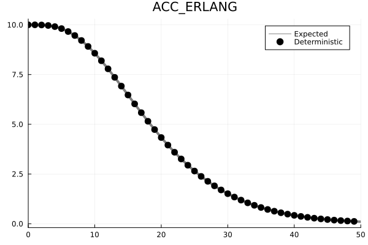
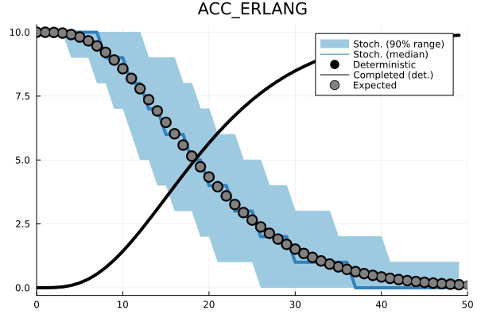
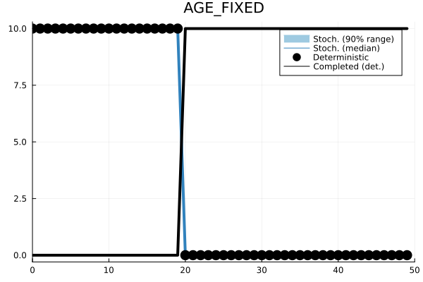
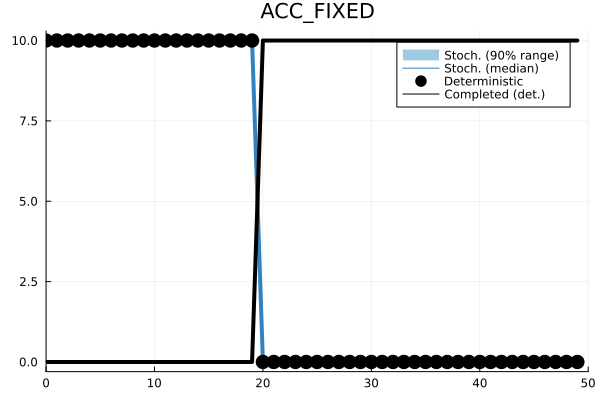
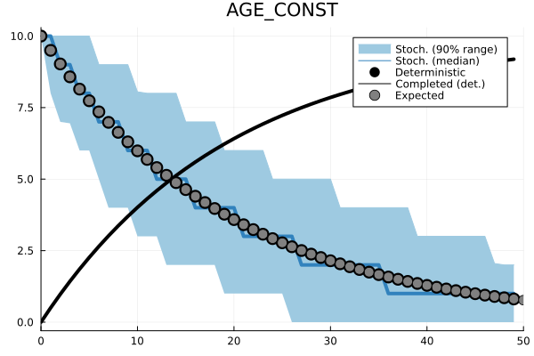

<style>
r { color: Red }
o { color: Orange }
g { color: Green }
</style>

# Population


Third-generation implementation of the dynamically-structured matrix population model, with multiple processes acting on member-classes, implementing both age-dependent and accumulative processes.

## Using the library

The following creates a pseudo-structured population with 10 individuals and iterates it one step with 0 mortality and an Erlang-distributed development time of $20\pm5$ steps.

```c
    char arbiters[2] = {ACC_ERLANG, STOP};
    population pop = spop2_init(arbiters, STOCHASTIC);

    number key = numZERO;
    number num = {.i = 10};

    spop2_add(pop, &key, num);

    number size;
    number completed;
    population poptabledone = spop2_init(arbiters, STOCHASTIC);

    double pr[2] = {20.0, 5.0};
    spop2_step(pop, pr, &size, &completed, &poptabledone);
```

> **Note:** Make sure you call `spop2_random_init` before declaring a `STOCHASTIC` population (and then, call `spop2_random_destroy` at the end). This can be omitted for `DETERMINISTIC` models.

> **Note:** `number` is declared in `population.h` as a `union` of `unsigned int` and `double`.

# Usage examples

## A deterministic population with Erlang-distributed accumulative development

Let's begin with a simple case of insect development. For this, we need to know the average duration of the larva stage and its variation. Let's assume that stage duration follows a [gamma](https://en.wikipedia.org/wiki/Gamma_distribution) distribution ([Erlang](https://en.wikipedia.org/wiki/Erlang_distribution) to be precise), which implies that all individuals race to develop out of the larva stage, while some are faster and even more of them are slower.

```c
    char arbiters[2] = {ACC_ERLANG, STOP};
    population pop = spop2_init(arbiters, DETERMINISTIC);

    number key[1] = {numZERO};
    number num = {.d=10.0};
    spop2_add(pop, key, num);

    printf("%d,%g,%g\n",0,spop2_size(pop).d,0.0);

    double par[2] = {20.0, 10.0};

    number sz, cm;
    int i;
    for (i=1; i<50; i++) {
        spop2_step(pop, par, &sz, &cm, 0);
        printf("%d,%g,%g\n",i,sz.d,cm.d);
    }
```



## Accounting for stochasticity

With a simple modification, we can simulate how the dynamics vary when each individual is given a daily chance of completing its development based on the Erlang-distributed development time assumption.

```c
    char arbiters[2] = {ACC_ERLANG, STOP};
    population pop = spop2_init(arbiters, STOCHASTIC);

    number key[1] = {numZERO};
    number num = {.i=10};
    spop2_add(pop, key, num);

    printf("%d,%u,%u\n",0,spop2_size(pop).i,0);

    double par[2] = {20.0, 10.0};

    number sz, cm;
    int i;
    for (i=1; i<50; i++) {
        spop2_step(pop, par, &sz, &cm, 0);
        printf("%d,%u,%u\n",i,sz.i,cm.i);
    }
```


## Distributions and assumptions

The sPop2 framework allows for [age-dependent](https://doi.org/10.12688/f1000research.15824.3) and [accumulative](https://doi.org/10.1038/s41598-022-15806-2) development times.

| Process     | Parameters   | Definition    |
| :---        |    :----:    |          ---: |
| ACC_ERLANG  | devmn, devsd | Erlang-distributed accumulative process   |
| ACC_PASCAL  | devmn, devsd | Pascal-distributed accumulative process   |
| ACC_FIXED   | devmn | Fixed-duration accumulative process   |
| AGE_FIXED   | devmn | Fixed-duration age-dependent process   |
| NOAGE_CONST | prob | Constant-rate age-independent process   |
| AGE_CONST   | prob | Constant-rate age-dependent process   |
| AGE_GAMMA   | devmn, devsd | Gamma-distributed age-dependent process   |
| AGE_NBINOM  | devmn, devsd | Negative binomial-distributed age-dependent process   |
| AGE_CUSTOM  | User-defined hazard function and stepper | Age-dependent or accumulative stepping with a user-defined hazard function |

| Age-dependent | Accumulative |
| :---        |    ---: |
|  |  |
|  |  |
|  |  |
|  |  |

## Combining multiple processes

Multiple processes can be added to an `sPop2` to represent more complex dynamics. For instance, we can represent survival with a daily constant rate and development with an Erlang-distributed accumulative process. The processes are executed in the order they are added to the `sPop2`.

```c
    char arbiters[3] = {AGE_CONST, ACC_ERLANG, STOP};
    population pop = spop2_init(arbiters, DETERMINISTIC);

    number key[2] = {numZERO,numZERO};
    number num = {.d=100.0};
    spop2_add(pop, key, num);

    printf("%d,%g,%g,%g\n",0,spop2_size(pop).d,0.0,0.0);

    number size, completed[2];
    double par[4] = {1.0/60.0, 30.0, 5.0};

    int i;
    for (i=0; i<100; i++) {
        spop2_step(pop, par, &size, completed, 0);
        printf("%d,%g,%g,%g\n",i+1,size.d,completed[0].d,completed[1].d);
    }
```

The above instruction represent a life stage with $0.017$ daily mortality and $30\pm5$ days of development time.


## Gonotrophic cycle with a negative impact of ovipositioning

In this section, we will attempt to reproduce [Figure 1](https://f1000research.com/articles/7-1220#f1) in the original age-dependent [sPop](https://doi.org/10.12688/f1000research.15824.3) model. We will represent an adult female mosquito with a lifetime of $20\pm2$ days. The female enters a cyclic process of obtaining bloodmeal and egg development, which takes about $2$ days. However, at the end of each ovipositioning, her expected lifetime decreases by $2$ days. I assure you that the actual physiology is far more complicated than this!

In order to represent the lifetime of this female mosquito, we will employ $3$ processes:

 * A custom age- and ovipositioning-dependent mortality process
 * An age-dependent gamma-distributed egg development process
 * A dummy process to count the number of ovipositioning events

```c
    // Declare an sPop2 population with deterministic dynamics,
    // and define three processes in this order: Mortality, Gonotropic cycle, Ovipositioning
    char arbiters[4] = {AGE_CUSTOM, AGE_GAMMA, AGE_CUSTOM, STOP};
    population pop = spop2_init(arbiters, DETERMINISTIC);

    pop->arbiters[0]->fun_calc = custom;
    pop->arbiters[2]->fun_step = 0;
```

The $3^{rd}$ process is a dummy (`AGE_CUSTOM`), which does not affect the population or even does not posess a time counter (`fun_step = 0`). The $2^{nd}$ process is the regular age-dependent gamma-distributed development process (`AGE_GAMMA`).

The mortality process, on the other hand, is defined with a `custom` function and uses an age counter. We included this stepper in process declaration, because we require that the status indicator be an age counter, _i.e._ the number of steps the `sPop2` is iterated is kept in the status indicator (see `qkey` below). We declare the `custom` function as the following.

```c
    double custom(hazard hfun, unsigned int d, number q, number k, double theta, const number *qkey) {
        double devmn = 480.0 - (qkey[2].i > 4 ? 240.0 : 48.0 * qkey[2].i);
        double devsd = 0.1 * devmn;
        hazpar hz = age_gamma_pars(devmn, devsd);
        double a = age_hazard_calc(age_gamma_haz, 0, qkey[0], hz.k, hz.theta, qkey);
        return a;
    }
```

With this function, we override an internal mechanism used by all other processes to calculate the probability of exit from the `sPop2` population. This way, we can link one process to another (mortality, development, or something else) if necessary. This generic functional form takes the following parameters.

 - `hfun` is a function to calculate the cumulative probability density of an exit event. It may use some of the other parameters to do so.
 - `d` refers to the number of days (more correctly time steps) elapsed in `sPop2`.
 - `q` refers to the fraction of development (used in accumulative processes).
 - `k` and `theta` are the parameters of the stage duration (development time) distribution.
 - `qkey` is an array of status indicators (age for age-dependent and development fraction for accumulative processes).

 Of all these, we use the status indicators to calculate the mean and standard deviation of mortality based on the third (_dummy_) process. 

```c
    double devmn = 480.0 - (qkey[2].i > 4 ? 240.0 : 48.0 * qkey[2].i);
    double devsd = 0.1 * devmn;
```

Then, we calculate the parameters of the corresponding gamma distribution using the internal function
```c
    hazpar hz = age_gamma_pars(devmn, devsd);
```
and, with these, we calculate the cumulative probability of daily mortality
```c
    double a = age_hazard_calc(age_gamma_haz, 0, qkey[0], hz.k, hz.theta, qkey); // qkey[0]: Mortality
```

Overall, the script to model the dynamics is given below.
```c
    double custom(hazard hfun, unsigned int d, number q, number k, double theta, const number *qkey) {
        double devmn = 480.0 - (qkey[2].i > 4 ? 240.0 : 48.0 * qkey[2].i);
        double devsd = 0.1 * devmn;
        hazpar hz = age_gamma_pars(devmn, devsd);
        double a = age_hazard_calc(age_gamma_haz, 0, qkey[0], hz.k, hz.theta, qkey);
        return a;
    }

    void fun_transfer(number *key, number num, void *pop) {
        number q[3] = {
            {.i=key[0].i},
            numZERO,
            {.i=key[2].i+1}
        };
        spop2_add(*(population *)pop, q, num);
    }

    void sim(char stoch) {
        int i, j;

        char arbiters[4] = {AGE_CUSTOM, AGE_GAMMA, AGE_CUSTOM, STOP};
        population pop = spop2_init(arbiters, stoch);

        population popdone[3];
        for (i=0; i<3; i++)
            popdone[i] = spop2_init(arbiters, stoch);

        pop->arbiters[0]->fun_calc = custom;
        pop->arbiters[2]->fun_step = 0;

        number key[3] = {numZERO,numZERO,numZERO};
        number num;
        if (stoch == STOCHASTIC) 
            num.i = 1000;
        else
            num.d = 1000.0;
        spop2_add(pop, key, num);

        if (stoch == STOCHASTIC)
            printf("%d,%d\n",0,0);
        else
            printf("%d,%g\n",0,0.0);

        number size, completed[3];
        double par[2] = {50.0, 10.0};

        for (i=0; i<480; i++) {
            spop2_step(pop, par, &size, completed, popdone);
            if (stoch == STOCHASTIC)
                printf("%d,%d\n",i+1,completed[1].i);
            else
                printf("%d,%g\n",i+1,completed[1].d);

            spop2_foreach(popdone[1], fun_transfer, (void *)(&pop));

            for (j=0; j<3; j++)
                spop2_empty(&popdone[j]);
        }
    }
```

At each step, `spop2_step` returns the following

- Current size of the population.
- Number of individuals completing each process in the given order.
- An array of `population`s with members completing each process.

The script adds all individuals completing a gonotrophic cycle (`popdone[1]`) back to `pop` one by one. While doing so, their status indicators are updated manually.

- `num` individuals are added
- Mortality indicator is trannsferred as is (`key[0]`: the first process already has a stepper) *(Editted in v0.1.0)*
- Egg development indicator is reset (`numZERO` is the 0 value of `number`)
- Ovipositioning indicator is incremented (`key[2] + 1`)


## Gonotrophic cycle with key-dependent parameters
*This is new in v0.1.0*

This recently added feature helps us simplify the above example a bit. By default, we deal with uniform properties across a population. Namely, the mean and standard deviation of development applies to all sub-groups, but each sub-group positions itself at a different level of completion.

In the example above, we used the hazard function (`fun_calc`) to access sub-group keys (`qkey`) and define specific lifetimes for each. Here we will use the `fun_q_par` function, which calculates mean and standard deviation for each group.

We redefine the `custom` function as follows.

```c
void custom(const number *qkey, const number num, double *par) {
    par[0] = 480.0 - (qkey[2].i > 4 ? 240.0 : 48.0 * qkey[2].i);
    par[1] = 0.1 * par[0];
}
```

It takes the following as parameters.

- `qkey` is the array of status indicators
- `num` is the number of individuals in the group
- `par` is the array of parameter(s) specific for the process chosen (mean and standard deviation could be the outputs of the function)

Here, we choose `AGE_GAMMA`, which takes $2$ parameters by default (mean and st.dev.). We reset these with `pop->numpars[0] = 0` and link `custom` with `pop->arbiters[0]->fun_q_par` to switch from population-wide parameters to group-specific ones.

The overall script is given below, which produces an output identical to that of the previous section.
```c
void custom(const number *qkey, const number num, double *par) {
    par[0] = 480.0 - (qkey[2].i > 4 ? 240.0 : 48.0 * qkey[2].i);
    par[1] = 0.1 * par[0];
}

void fun_transfer(number *key, number num, void *pop) {
    number q[3] = {
        {.i=key[0].i},
        numZERO,
        {.i=key[2].i+1}
    };
    spop2_add(*(population *)pop, q, num);
}

void sim(char stoch) {
    if (stoch)
        spop2_random_init();

    int i, j;

    char arbiters[4] = {AGE_GAMMA, AGE_GAMMA, AGE_CUSTOM, STOP};
    population pop = spop2_init(arbiters, stoch);

    population popdone[3];
    for (i=0; i<3; i++)
        popdone[i] = spop2_init(arbiters, stoch);

    pop->arbiters[0]->fun_q_par = custom;
    pop->numpars[0] = 0;
    //
    pop->arbiters[2]->fun_step = 0;

    number key[3] = {numZERO, numZERO, numZERO};
    number num;
    if (stoch == STOCHASTIC) 
        num.i = 1000;
    else
        num.d = 1000.0;
    spop2_add(pop, key, num);

    if (stoch == STOCHASTIC)
        printf("%d,%d\n",0,0);
    else
        printf("%d,%g\n",0,0.0);

    number size, completed[3];
    double par[2] = {50.0, 10.0};

    for (i=0; i<480; i++) {
        spop2_step(pop, par, &size, completed, popdone);
        if (stoch == STOCHASTIC)
            printf("%d,%d\n",i+1,completed[1].i);
        else
            printf("%d,%g\n",i+1,completed[1].d);

        spop2_foreach(popdone[1], fun_transfer, (void *)(&pop));

        for (j=0; j<3; j++)
            spop2_empty(&popdone[j]);
    }
}
```

## Harvesting a population
*This is new in v0.1.4*

The `spop2_foreach` function above transfers the entire population, class by class, into the target population. To extract only a fraction of each class, maybe a fraction based on the sub-group key, we can use the newly introduced `spop2_harvest` function.

Here, we create $N$ populations with age-structured development time and initiate the first one with $100$ individuals. At each iteration, we transfer a fraction of the individuals completing their development into the second population, and move the rest to the third population, and so on. We collect all individuals in the last two populations.

We can use the following macro definitions to set $N$, stochasticity, and the age of the transferred population.
```c
#define N 5
#define STOCH FALSE
#define NEWAGE FALSE
```

By default, we transfer the individuals as they are, with their final ages kept intact. Due to their age, however, they are quickly removed from the sub=sequent population as well. By setting the macro `NEWAGE` as `TRUE`, we reset the age of the transferred and provide them with the opportunity to go through another development process from the start.

```c
void fun_harvest(number *key, number num, number *newkey, double *frac) {
    newkey[0].i = NEWAGE ? 0 : key[0].i;
    *frac = 0.5;
}

void fun_rest(number *key, number num, number *newkey, double *frac) {
    newkey[0].i = key[0].i;
    *frac = 1.0;
}
```

The functions `fun_harvest` and `fun_rest` handle transfers to the subsequent populations, while setting the fraction of individuals to be transferred (`frac`) and their sub-group keys (`newkey`).

```c
    char arbiters[2] = {AGE_GAMMA, STOP};
    population *pop = (population *)malloc(N * sizeof(population));
    population *popdone = (population *)malloc(N * sizeof(population));
    for (j=0; j<N; j++) {
        pop[j] = spop2_init(arbiters, stoch);
        popdone[j] = spop2_init(arbiters, stoch);
    }

    number key = numZERO;
    number num = {.d = 100.0};
    spop2_add(pop[0], &key, num);

    number size[N], completed[N];
    double par[2] = {48.0, 6.0};

    for (i=0; i<240; i++) {
        for (j=0; j<(N-2); j++)
            spop2_step(pop[j], par, &size[j], &completed[j], &popdone[j]);

        for (j=0; j<(N-2); j++) {
            spop2_harvest(popdone[j], pop[j+1], fun_harvest);
            spop2_harvest(popdone[j], pop[j+2], fun_rest);
        }

        for (j=0; j<N; j++)
            spop2_empty(&popdone[j]);
    }

    for (j=0; j<N; j++) {
        spop2_free(&pop[j]);
        spop2_free(&popdone[j]);
    }
```


# Case studies

## Nicholson's blowflies
*with special thanks to Sean L. Wu [\@slwu89](https://github.com/slwu89)*

Nicholson’s blowflies are a classic example of a time-delayed stage-structured population model, and was presented as a case study in the [sPop paper](https://f1000research.com/articles/7-1220). We reproduce that example here using the `Population` library.

The model comprises five distinct life-stages and exhibits stable quasi-cyclic oscillations. Although the model was originally constructed using delay differential equations, `Population` adheres well to the observed dynamics despite the discrete time step. We demonstrate both deterministic and stochastic versions of the basic dynamical model.

First we define parameters of the model.
```c
    // Define daily propensity of death
    double death[5] = {0.07, 0.004, 0.003, 0.0025, 0.27};

    // Define the expected duration of development (in days)
    double develop[5] = {0.6, 5.0, 5.9, 4.1, 1e13};

    // Define the rest of the parameters
    double A0 = 600.0;
    double q = 8.5;
    double tau = 24.0;
    // tau is a scaling factor to extend from daily to hourly iterations for more accurracy
```

Next we define a function to run the simulation for 300 days, in either stochastic or deterministic mode. The 5 life stages are stored in the vector `pop`. Each life stage has a `NOAGE_CONST` process for simulating mortality, which is independent of age in the blowflies model. It also has an `AGE_FIXED` process to simulate maturation, which has a deterministic (fixed) distribution in the blowflies model. Therefore variation in the stochastic version arises from the mortality process and egg laying, which is assumed to be drawn from a Poisson distribution centered on the deterministic mean.

On each day we calculate the terms required for the mortality and development processes (`par[0]` and `par[1]`). Then, we use `spop2_step` to iterate the population for one day. Following a step, the function stores the total population size in `size[i]` and the number of individuals completing development in `completed[i]` for population `i`. Then, we pass individuals who have completed development to the next life stage. Finally, we compute the number of eggs produced by adults and add them to the egg stage.

```c
    extern gsl_rng *RANDOM;

    void sim(char stoch, char id) {
        int i, j, k;

        double death[5] = {0.07, 0.004, 0.003, 0.0025, 0.27};
        double develop[5] = {0.6, 5.0, 5.9, 4.1, 1e13};
        double A0 = 600.0;
        double q = 8.5;
        double tau = 24.0;

        char arbiters[3] = {NOAGE_CONST, AGE_FIXED, STOP};

        population pop[5];
        for (i=0; i<5; i++)
            pop[i] = spop2_init(arbiters, stoch);

        number key[2] = {numZERO,numZERO};
        number num;
        if (stoch == STOCHASTIC) 
            num.i = 500;
        else
            num.d = 500.0;
        spop2_add(pop[0], key, num);

        if (stoch == STOCHASTIC) {
            printf("%d,%d",id,0); for (i=0; i<5; i++) printf(",%d",spop2_size(pop[i]).i); printf("\n");
        } else {
            printf("%d,%d",id,0); for (i=0; i<5; i++) printf(",%g",spop2_size(pop[i]).d); printf("\n");
        }

        number size[5], completed[5][2];
        double par[2];
        number eggs;

        for (j=0; j<300*tau; j++) {
            for (i=0; i<5; i++) {
                par[0] = death[i] / tau;
                par[1] = develop[i] * tau;
                spop2_step(pop[i], par, &size[i], completed[i], 0);

                if (i) {
                    spop2_add(pop[i], key, completed[i-1][1]);
                }
            }

            if (stoch == STOCHASTIC) {
                double tmp = q * (double)size[4].i * exp(-(double)size[4].i / A0) / tau;
                eggs.i = (unsigned int)gsl_ran_poisson(RANDOM, tmp);
            } else {
                eggs.d = q * size[4].d * exp(-size[4].d / A0) / tau;
            }
            spop2_add(pop[0], key, eggs);

            if (stoch == STOCHASTIC) {
                printf("%d,%d",id,j); for (k=0; k<5; k++) printf(",%d",spop2_size(pop[k]).i); printf("\n");
            } else {
                printf("%d,%d",id,j); for (k=0; k<5; k++) printf(",%g",spop2_size(pop[k]).d); printf("\n");
            }
        }
    }
```

We run the deterministic model, and sample 100 trajectories from the stochastic model. We plot results from the last 200 days of simulation.


